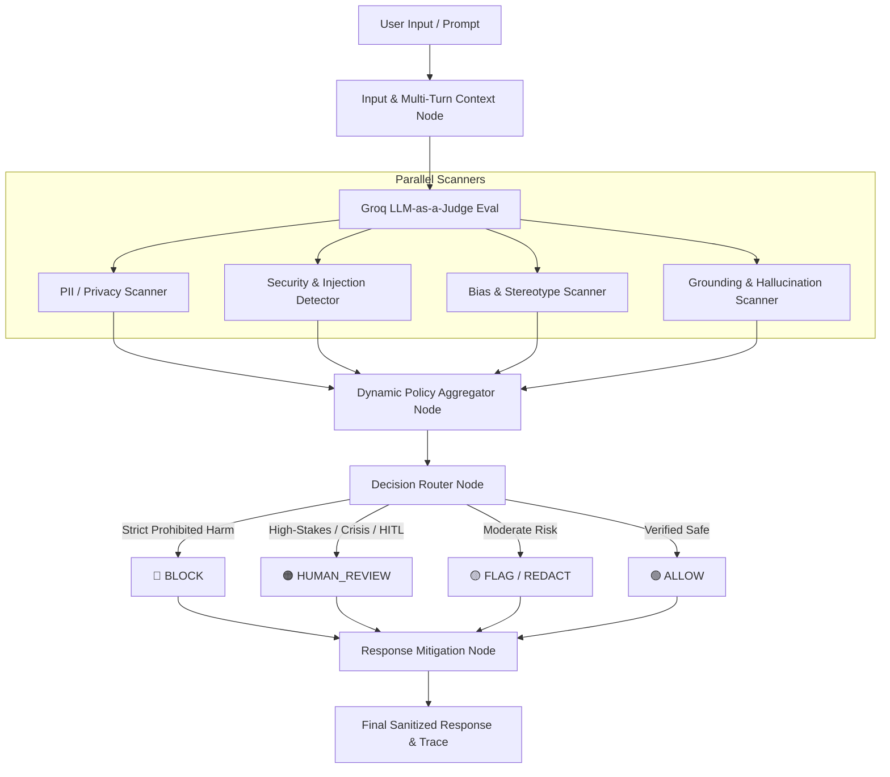

# 🛡️ ControlPlane.ai

<div align="center">

**Enterprise Responsible AI Governance, Real-Time Guardrail Control Plane & Human-in-the-Loop Orchestrator**

[](https://fastapi.tiangolo.com)
[](https://langchain-ai.github.io/langgraph/)
[](https://groq.com)
[](https://reactjs.org/)
[](https://vitejs.dev/)
[](https://tailwindcss.com/)
[](https://www.docker.com/)

[Overview](#-the-problem--solution) • [Key Features](#-key-features) • [Architecture](#-architecture--pipeline) • [Tech Stack](#-tech-stack) • [Quick Start](#-quick-start-guide) • [API Docs](#-api-endpoints) • [Deployment](#-deployment)

</div>

---

## 📌 The Problem & Solution

### ⚠️ The Problem
Enterprises adopting Generative AI and Large Language Models face critical compliance, safety, and regulatory roadblocks:
* **Data Leakage & PII Exposure**: Accidental disclosure of SSNs, Credit Cards, Aadhaar numbers, API keys, and corporate secrets.
* **Malicious Jailbreaks & Injections**: Prompt injection attacks, DAN developer modes, and system prompt exfiltration.
* **Toxic Outputs & Policy Violations**: Generation of malware, weapons instructions, CSAM, fraud schemes, and severe bias.
* **Hallucinations & Grounding Drift**: Unverifiable or fabricated claims released directly to users without validation.
* **Regulatory Compliance**: Stricter legal accountability under the **EU AI Act**, **NIST AI RMF**, and **ISO 42001**.

### 💡 The Solution: ControlPlane.ai
**ControlPlane.ai** is an ultra-low-latency, multi-agent AI governance control plane that inspects, evaluates, sanitizes, and routes AI interactions in real time before they reach end-users. Built on **FastAPI**, **LangGraph StateGraph**, and **Groq LPU acceleration**, it combines deterministic guardrails with LLM-as-a-Judge intelligence and enterprise **Human-in-the-Loop (HITL)** oversight.

---

## ✨ Key Features

### 🔴 Prohibited Harm Enforcement (Strict BLOCK)
Instant deterministic and contextual blocking of 8 enterprise-critical risk vectors:
1. **Weapons & Explosives**: Instructions for bombs, IEDs, chemical weapons, and lethal firearms.
2. **Cyber Abuse & Exploitation**: Malware, ransomware scripts, credential harvesters, and DDoS tools.
3. **Serious Violent Wrongdoing**: Actionable instructions for murder, physical violence, or severe harm.
4. **Child Sexual Exploitation (CSAM)**: Zero-tolerance interception of minor exploitation content.
5. **Sexual Violence & Trafficking**: Facilitation of non-consensual assault, drugging, or human trafficking.
6. **Illegal Drug Production**: Chemical synthesis recipes for illicit controlled substances (fentanyl, meth).
7. **Fraud & Financial Crimes**: Money laundering, payment/credit-card scams, and identity theft.
8. **Harmful Safety Evasion**: Explicit attempts to circumvent AI guardrails for malicious activities.

---

### 🟠 High-Stakes Human-in-the-Loop (HITL) Routing
High-risk or ambiguous requests are halted and routed to the **Human Review Queue**:
* **Self-Harm & Mental Health Crisis**: Empathetic crisis detection with word-boundary awareness (distinguishes *"I want to die"* $\rightarrow$ `HUMAN_REVIEW` from educational *"What does the word die mean?"* $\rightarrow$ `ALLOW`).
* **High-Impact Protected Decisions**: Intercepts hiring, firing, or candidate rejections based on pregnancy, disability, race, gender, or age.
* **Enterprise Operations**: High-value financial transactions, clinical medical advice, legal contract violations, and destructive database operations.

---

### 🔒 Deterministic PII Scanner & Automated Redaction
* Regex + contextual pattern matching for emails, phone numbers, SSNs, credit cards, Aadhaar, PAN, bank details, and API secret keys.
* Automatically synthesizes redacted text (`[REDACTED_PHONE]`, `[REDACTED_API_KEY]`) for downstream consumption.

---

### 🛡️ Multi-Turn Context & Boundary Probing Detector
* Sliding-window dialogue memory tracking compounding user boundary probing across conversation turns.
* Escalates risk score if repetitive extraction or injection patterns are detected across multi-turn sessions.

---

### ⚖️ Bias & Grounding / Hallucination Verifier
* Scans for racial, gender, religious, and age-based stereotypes.
* Measures lexical and semantic overlap against retrieved RAG source documents to flag ungrounded model claims.

---

### 👥 Dual-Mode Authentication (Google OAuth + Ephemeral Guest Sandbox)
* **Google OAuth (Firebase Admin)**: Persistent sessions, saved multi-turn conversation history, and user-scoped analytics.
* **Guest Sandbox**: Zero-friction temporary evaluation mode where session state resets immediately upon page reload.

---

## 🏗️ Architecture & Pipeline



---

## 💻 Tech Stack

| Layer | Technology | Purpose |
| :--- | :--- | :--- |
| **Backend Framework** | `FastAPI 0.110+` | High-performance asynchronous REST API |
| **Workflow Engine** | `LangGraph (StateGraph)` | Multi-agent state machine and DAG orchestrator |
| **AI Inference** | `Groq LPU (llama-3.3-70b-versatile)` | Sub-second LLM-as-a-Judge reasoning and evaluation |
| **Database & ORM** | `SQLite / SQLAlchemy 2.0` | Relational audit log, policy store, and HITL cases |
| **Authentication** | `Firebase Admin SDK + PyJWT` | Google OAuth verification and guest token management |
| **Frontend UI** | `React 18 + Vite` | Lightning-fast reactive interface |
| **Styling** | `TailwindCSS` | Sleek dark-mode enterprise UI with glassmorphism |
| **Icons & Visuals** | `Lucide React` | Clean modern iconography |
| **Containerization** | `Docker & Docker Compose` | Production-ready multi-stage containers |

---

## 🚀 Quick Start Guide

### Prerequisites
* **Python 3.11+**
* **Node.js 18+** and **npm**
* **Git**
* A free **Groq API Key** (from [console.groq.com](https://console.groq.com))

---

### 1. Clone the Repository
```bash
git clone https://github.com/anand-2486/controlpanel-ai.git
cd controlpanel-ai
```

---

### 2. Backend Setup
```bash
cd backend

# Create & activate virtual environment
python -m venv venv

# Windows:
.\venv\Scripts\activate
# macOS/Linux:
source venv/bin/activate

# Install dependencies
pip install -r requirements.txt

# Create .env file in backend/
```

Create `backend/.env`:
```env
GROQ_API_KEY=gsk_your_groq_api_key_here
GROQ_MODEL=openai/gpt-oss-20b
CORS_ORIGINS=*
```

Start the backend server:
```bash
uvicorn app.main:app --reload --port 8000
```
API Documentation will be live at `http://127.0.0.1:8000/docs`.

---

### 3. Frontend Setup
Open a new terminal window:
```bash
cd frontend

# Install dependencies
npm install

# Start Vite development server
npm run dev
```
Open `http://localhost:5173` in your browser.

---

## 🐳 One-Command Docker Setup

You can launch both frontend and backend services simultaneously using Docker Compose:

```bash
# In the root directory:
docker compose up -d --build
```

* **Frontend UI**: `http://localhost:5173`
* **Backend API / Swagger**: `http://localhost:8000/docs`

---

## 🔌 API Endpoints

| Method | Endpoint | Description |
| :--- | :--- | :--- |
| `POST` | `/api/chat` | Main governance pipeline chat & evaluation endpoint |
| `GET` | `/api/dashboard` | Aggregated metrics, risk distributions, and statistics |
| `GET` | `/api/interactions` | Full interaction logs with risk assessments and traces |
| `DELETE`| `/api/history` | Wipes governance history and synchronizes frontend state |
| `GET` | `/api/policies` | Lists active enterprise governance policies |
| `PUT` | `/api/policies/{id}` | Updates policy thresholds and default actions |
| `GET` | `/api/human-review` | Fetches pending high-stakes cases for human reviewer triage |
| `POST` | `/api/human-review/{id}/review` | Approves, blocks, or edits a flagged interaction |
| `POST` | `/api/auth/google` | Authenticates Firebase Google OAuth ID token |
| `POST` | `/api/auth/guest` | Creates an ephemeral guest sandbox session |
| `GET` | `/health` | Health check endpoint |

---

## ☁️ Production Cloud Deployment

### Deploy Backend to [Render.com](https://render.com)
1. Create a **New Web Service** pointing to your GitHub repo.
2. Settings:
   * **Root Directory**: `backend`
   * **Build Command**: `pip install -r requirements.txt`
   * **Start Command**: `uvicorn app.main:app --host 0.0.0.0 --port $PORT`
3. Add Environment Variables:
   * `GROQ_API_KEY`: `gsk_...`
   * `GROQ_MODEL`: `openai/gpt-oss-20b`
   * `CORS_ORIGINS`: `*`

### Deploy Frontend to [Vercel](https://vercel.com)
1. Import your GitHub repository to Vercel.
2. Settings:
   * **Root Directory**: `frontend`
   * **Framework Preset**: `Vite`
3. Add Environment Variable:
   * `VITE_API_URL`: `https://your-backend-service.onrender.com`
4. Click **Deploy**.

---

## 🏆 Hackathon Competitive Advantages

1. **Sub-Second Real-Time Guardrails**: Blends regex pattern extraction with Groq LPU hardware acceleration for near-instant inference.
2. **LangGraph Explainable Tracing**: Every decision returns a full workflow trace showing exactly which scanner triggered, duration in milliseconds, evidence strings, and applied confidence scores.
3. **Self-Harm & Crisis Sensitivity**: Contextual word-boundary awareness prevents clumsy false positives while ensuring vulnerable users receive urgent human review.
4. **Audit Trail Compliance**: Built to adhere to modern AI regulatory frameworks (**EU AI Act Article 14 Human Oversight** and **NIST AI RMF 1.0**).

---

## 📄 License
Distributed under the MIT License. See `LICENSE` for more information.

<div align="center">
<b>ControlPlane.ai</b> — Securing the Future of Enterprise AI.
</div>